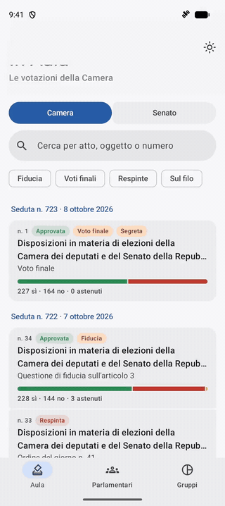
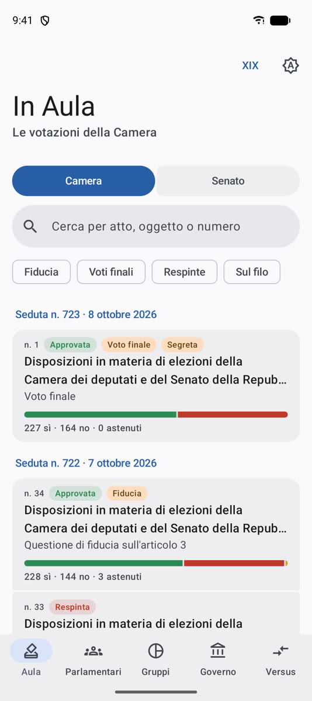
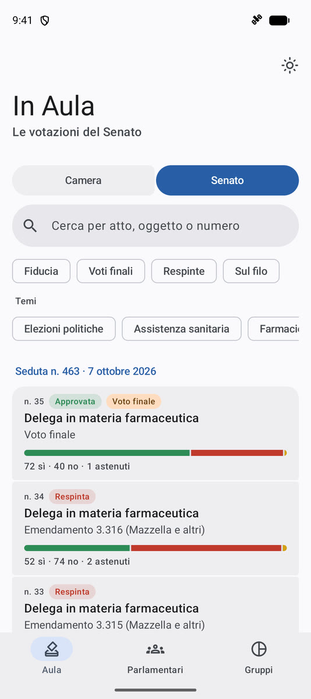
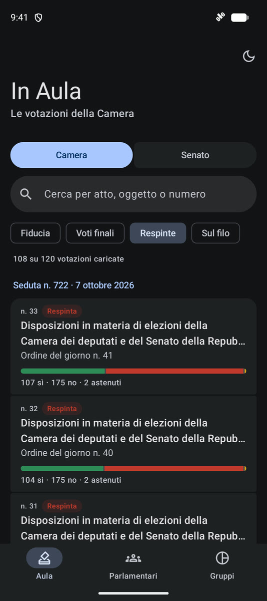
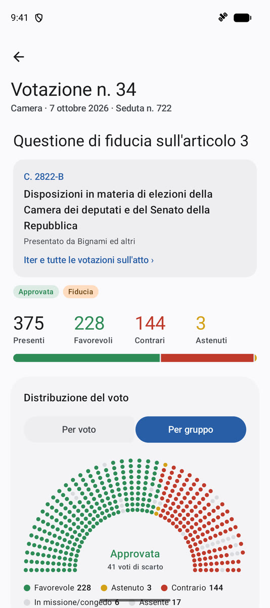
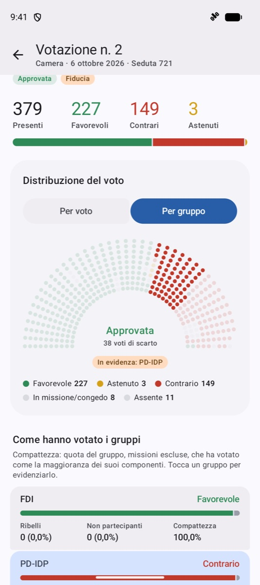
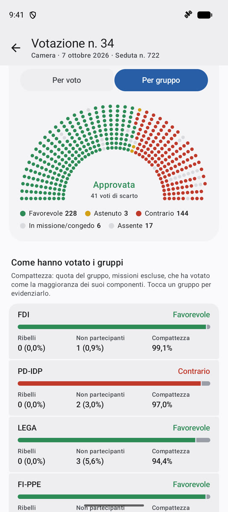
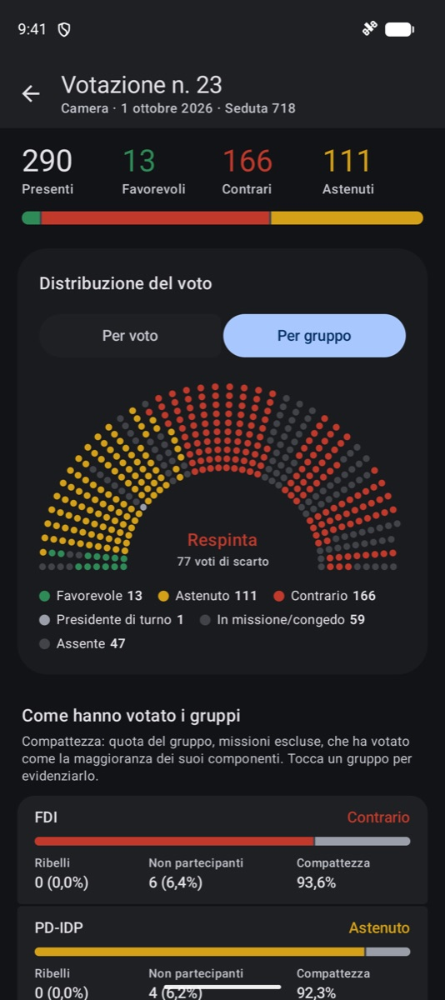
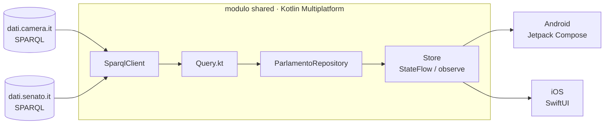

<div align="center">


# In Aula

**Cosa succede davvero in Parlamento, voto per voto.**

App Kotlin Multiplatform che racconta l'attività di Camera e Senato a partire dai loro open data:
sedute, votazioni, come ha votato ogni gruppo e ogni parlamentare, presenze e cambi di casacca.

[](https://github.com/vincenzosarnataro/In-Aula/releases/latest)




<sub>🎬 [Video in qualità piena (MP4)](docs/media/demo.mp4)</sub>

</div>

---

Aula non ha un backend: l'app interroga direttamente gli endpoint SPARQL pubblici
[`dati.camera.it`](https://dati.camera.it/sparql) e [`dati.senato.it`](https://dati.senato.it/sparql).
Tutta la logica sta nel modulo condiviso `shared`; le interfacce sono native, Jetpack Compose su
Android e SwiftUI su iOS.

## ✨ Funzionalità

### 🗳️ Le votazioni in Aula

<table>
<tr>
<td width="33%"></td>
<td width="33%"></td>
<td width="33%"></td>
</tr>
</table>

- **Camera e Senato** a portata di un tocco, con le votazioni raggruppate per seduta.
- Per ogni votazione: esito, sì/no/astenuti con una barra proporzionale, ed etichette
  **Fiducia**, **Voto finale**, **Segreta**, **Sul filo**.
- **Filtri rapidi**: fiducia, voti finali, respinte e votazioni *sul filo*, cioè quelle in cui
  per ribaltare l'esito bastava al massimo il 5% dei votanti (minimo 5 voti).
- **Ricerca** per numero dell'atto, titolo o oggetto (“emendamento 8.1010”, “C. 2822”…).
- **Temi** del thesaurus TESEO per le votazioni del Senato ("Assistenza sanitaria", "Elezioni politiche"…).
- Scorrimento infinito e pulsante *Cerca nelle votazioni precedenti* quando i filtri non trovano nulla.

### 📊 Il dettaglio di una votazione

<table>
<tr>
<td width="33%"></td>
<td width="33%"></td>
<td width="33%"></td>
</tr>
</table>

- **Emiciclo animato**: un pallino per ogni parlamentare, colorato in base al voto, ordinabile
  *per voto* o *per gruppo*. Quando cambia l'ordinamento ogni pallino raggiunge il suo nuovo seggio con un'animazione a molla.
- **Come hanno votato i gruppi**: linea del gruppo, ribelli, non partecipanti e
  **indice di compattezza** calcolato come Openpolis (missioni escluse). Tocca un gruppo e l'emiciclo lo mette in evidenza.
- **Voto nominale** di ogni deputato o senatore, filtrabile per gruppo o solo sui **ribelli**.
- **Assenze decisive** (Camera): segnala quando gli assenti dei gruppi che hanno perso sarebbero bastati a ribaltare l'esito, e quali gruppi ce l'avrebbero fatta da soli.
- **L'atto collegato**, anche quando i dati ufficiali non lo indicano ancora: viene ricavato dalle altre votazioni della seduta, e in quel caso l'app lo segnala come dedotto.

<p align="center"><br><sub>Con il tema scuro</sub></p>

### 📜 La scheda di un provvedimento

<table>
<tr>
<td width="33%"></td>
<td>

- **Iter nei due rami**, una lettura dopo l'altra: C. 2822 → S. 1971 → C. 2822-B, con stato e data.
- **Dettagli**: iniziativa, data di presentazione, primo firmatario e altri firmatari, relatori, temi.
- **Tutte le votazioni d'Aula sull'atto**, in tutte le sue letture, ciascuna apribile nel dettaglio.

</td>
</tr>
</table>

### 👥 I parlamentari

<table>
<tr>
<td width="33%"></td>
<td width="33%"></td>
<td>

- **Deputati e senatori in carica**, cercabili per nome o gruppo.
- Filtro **Hanno cambiato gruppo**, per trovare subito chi ha cambiato casacca in questa legislatura.
- **Scheda personale**: tutti i gruppi di appartenenza con le date di adesione.
- **Partecipazione al voto** calcolata con la formula Openpolis: presenze, missioni e assenze sulle votazioni della legislatura.
- **Voti espressi**: quanti favorevoli, contrari e astenuti.

</td>
</tr>
</table>


## 🧱 Struttura

```
shared/      modulo KMP: client SPARQL, query, repository, store condivisi
androidApp/  UI Compose (Material 3)
iosApp/      UI SwiftUI, progetto descritto con XcodeGen (project.yml)
```



Nel modulo `shared`, `SparqlClient` gestisce le due fonti con le loro regole. La Camera ogni tanto smette di rispondere per qualche secondo, quindi ogni richiesta viene ritentata fino a cinque volte con backoff esponenziale. Il Senato blocca con un 403 chi fa più di una richiesta ogni due secondi circa, e rifiuta request-URI oltre 2047 byte senza accettare il POST: le richieste al Senato passano quindi da una coda sequenziale con intervallo minimo di due secondi, e ogni query viene compattata e misurata prima dell'invio. `Query.kt` raccoglie le query SPARQL e `ParlamentoRepository` le traduce in modelli di dominio (`Votazione`, `Seduta`, `VotoIndividuale`, `Parlamentare`, `Presenze`). Gli store (`AulaStore`, `VotazioneStore`, `ParlamentariStore`, `ParlamentareStore`) espongono uno `StateFlow` per Compose e un metodo `observe` per SwiftUI, così Swift non deve maneggiare Flow o coroutine.

Le query non sono inventate: struttura e proprietà sono riprese da [ondata/italianparliament-mcp](https://github.com/ondata/italianparliament-mcp), dove sono state verificate sul campo, comprese le trappole di Virtuoso. Le principali sono queste: le date della Camera sono stringhe `YYYYMMDD` e vanno confrontate dentro `STR()`; i voti della Camera stanno in due named graph e vanno contati con `COUNT(DISTINCT)`; le liste vanno limitate in una subquery prima di agganciare gli `OPTIONAL`.

## 🧮 Come si calcolano le presenze

La formula è quella di Openpolis. Le presenze sono i voti espressi più le partecipazioni senza scelta registrata (scrutinio segreto e turni di presidenza alla Camera, "presente non votante" al Senato). Le missioni sono una categoria a sé e non contano come assenze.

Alla Camera il "Non ha votato" viene scomposto grazie a `dc:description` in "In missione", "Presidente di turno" e "Non ha partecipato", che è l'unica vera assenza. Il denominatore è il numero di votazioni registrate per quel deputato, che coincide già con il periodo del suo mandato.

Al Senato l'assente semplice non viene registrato. Per questo il denominatore è il numero di votazioni cadute dentro il mandato del senatore, e l'assenza si ottiene per differenza. I risultati sono confrontabili con Openpolis entro circa un punto percentuale, perché Openpolis esclude alcune votazioni e fotografa i dati in un momento diverso.

## 🚀 Avvio

Per **Android** basta aprire la cartella in Android Studio ed eseguire `androidApp`, oppure lanciare:

```sh
./gradlew :androidApp:installDebug
```

Per **iOS** (17 o successivo) servono [XcodeGen](https://github.com/yonaskolb/XcodeGen) e un JDK 17 o superiore nel PATH di Xcode:

```sh
brew install xcodegen
cd iosApp && xcodegen
open Aula.xcodeproj
```

Il progetto generato esegue `./gradlew :shared:embedAndSignAppleFrameworkForXcode` prima di ogni build, quindi il framework `Shared` resta sempre allineato al codice Kotlin.

I test del modulo condiviso si lanciano con `./gradlew :shared:allTests`. Tra le altre cose verificano che ogni query del Senato resti sotto il limite di 2047 byte.

## ⚠️ Limiti noti

- Le classifiche di presenza di tutti i parlamentari non sono incluse: calcolarle sul device richiederebbe una query per persona, e al Senato significa minuti di attesa. Se serviranno, conviene precalcolarle con un job schedulato.
- Il LOD delle sedute della Camera è l'area più in ritardo, quindi le votazioni degli ultimi giorni possono comparire con qualche giorno di ritardo.
- La scheda di un provvedimento ricostruisce l'iter nei due rami dai dati del Senato, che registra anche le letture della Camera; per gli atti che non sono ancora arrivati al Senato l'iter non c'è. Le votazioni della Camera si trovano per numero dell'atto e per deduzione nelle sedute in cui è citato.
- Filtri e ricerca della lista agiscono sulle votazioni già caricate; per andare più indietro c'è il pulsante "Cerca nelle votazioni precedenti".
- Le assenze decisive si calcolano solo alla Camera: il Senato non registra l'assente semplice.
- L'endpoint del Senato blocca per qualche minuto (HTTP 403) chi fa troppe richieste ravvicinate, oltre al limite di una ogni 2 secondi.
- Alla Camera il collegamento ufficiale tra votazione e atto (`ocd:rif_attoCamera`) arriva con mesi di ritardo, e le descrizioni recenti sono sigle provvisorie ("EM 8.1010"). L'app ricava l'atto dal numero citato nella descrizione oppure, per emendamenti e articoli, dalla votazione successiva della stessa seduta che lo cita. Sui dati di gennaio–maggio 2026 la deduzione è giusta nel 95% dei casi, e nell'app l'atto dedotto è segnalato.
- Al Senato i voti di fiducia non sono collegati al DDL, e la natura del voto (fiducia, voto finale) si deduce dall'etichetta.


## 📄 Fonti dei dati

I dati provengono dagli open data della **Camera dei Deputati** ([dati.camera.it](https://dati.camera.it)) e del **Senato della Repubblica** ([dati.senato.it](https://dati.senato.it)), rilasciati con licenza [CC-BY](https://creativecommons.org/licenses/by/4.0/deed.it). Aula è un progetto indipendente e non è affiliato a nessuna delle due istituzioni. La metodologia di presenze e compattezza segue quella di [Openpolis](https://www.openpolis.it).
